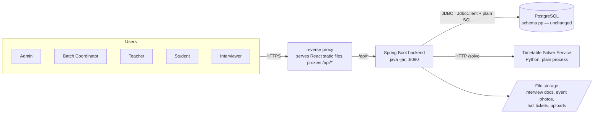
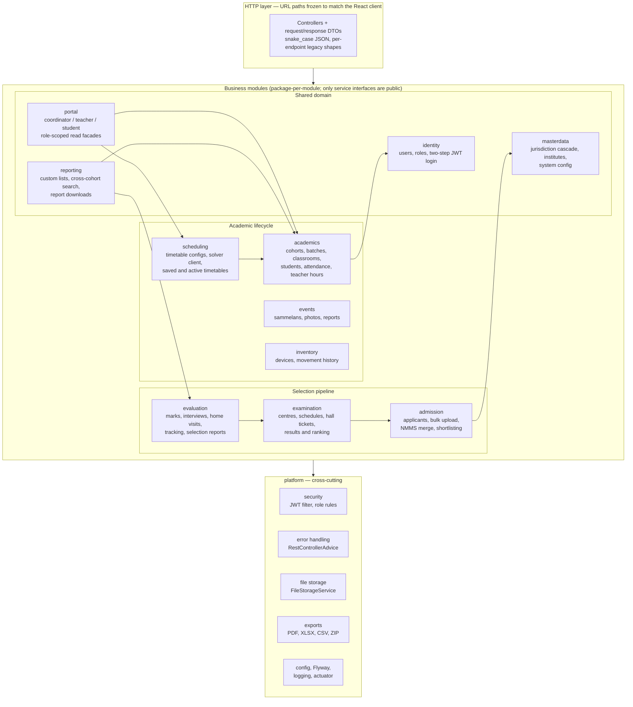
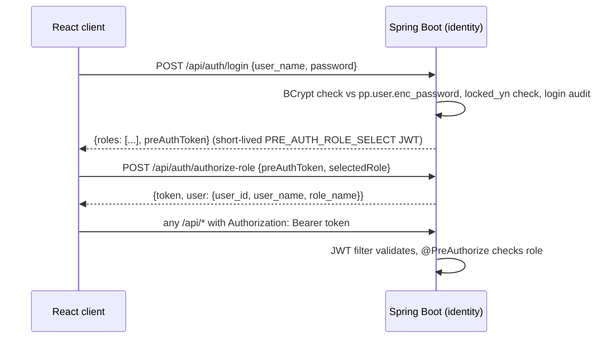
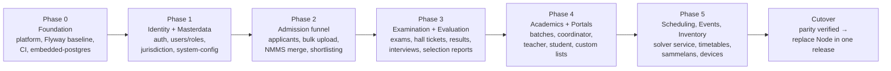

# IMAS Backend Migration to Java / Spring Boot — Design

**Date:** 2026-07-04
**System:** IMAS (PP-Portal) — Management Information System of Rajalaxmi Children Foundation (RCF), Pratibha Poshak program
**Scope:** Rewrite the Node.js/Express backend as a Spring Boot application. The React frontend and the PostgreSQL schema (`pp`, ~50 tables) remain unchanged.

---

## 1. Context and Goals

IMAS automates the Pratibha Poshak talent-search program end to end: NMMS applicant intake and fuzzy merge, shortlisting, exam logistics with PDF hall tickets, evaluation, interviews and home visits, final selection, then the academic lifecycle — cohorts, batches, timetables, attendance, teacher hours, events (Sammelans), device inventory — across five roles: `ADMIN`, `BATCH COORDINATOR`, `TEACHER`, `STUDENT`, `INTERVIEWER`.

The current backend is Express with ~290 active endpoints in 31 route files, raw parameterized SQL via `pg`, and significant accumulated debt:

- ~80% of endpoints have **no authentication**; JWT roles are **never enforced** server-side.
- `/logs` (server logs) and `/Data` (entire file-storage tree) are served publicly.
- Broken, unmounted global error handler; duplicated body parsers; four multer configs; six CSV libraries; three date libraries.
- Verbatim endpoint duplication (evaluation copies custom-list; duplicate student controllers; three generations of commented-out coordinator routes).
- Timetable generation shells out to a Python solver at a hardcoded absolute path.
- No tests, no migration tooling.

**Goals of the migration:** maintainability for a small team, a foundation for the v3.0 roadmap (alumni, notifications, staff role), proper security enforcement, and behavioral parity with the frontend's existing API contract.

## 2. Decisions

> **Guiding principle — simple over clever, and simple over maximally secure.** The overriding goal is code that is readable, direct, and easy to follow. Where a simpler design and a more secure/comprehensive design conflict, we choose the simpler one and document the trade-off. Security hardening is applied only where it is also simple (see §12).

| Decision | Choice |
|---|---|
| Migration strategy | **Big-bang cutover** — build the full Spring Boot backend, verify parity against Node, then replace Node in a single release. One backend runs at a time; no dual-running, no nginx traffic-splitting. |
| Data access | **Spring `JdbcClient` + plain parameterized SQL for everything.** No JPA/Hibernate, no `@Entity`, no Spring Data repositories. SQL is ported nearly verbatim from the Node models. |
| Security | **Enforce auth + roles, keep it simple** — JWT required on all endpoints except public ones; per-module `@PreAuthorize` role checks. No rate-limiting, CSP, password-strength, or lockout machinery (see §12). |
| Timetable solver | **Keep Python** — wrap `tt.py` in a small HTTP service (plain process, no Docker); Spring calls it. Deferred to the scheduling phase. |
| Stack | **Java 21 LTS, Spring Boot 3.x, Maven, single deployable JAR** (`java -jar`, no Docker). |
| Testing | **Zonky embedded-postgres** — real PostgreSQL from a bundled binary, no Docker daemon. |
| Code organization | **Modular monolith** — package per business module, shared `platform` layer, service-interface-only boundaries |
| Database baseline | **Live production `pg_dump`** (`imas_schema_05_07_2026`) is the schema source of truth — a real PostgreSQL 18 dump of the `pp` schema. `V1__baseline.sql` is derived from it (excluding the unrelated `public.*` tables that share the database). |
| Frontend / DB schema | **Unchanged** — URL paths, JSON shapes, and schema are frozen contracts |

## 3. Target Architecture — System Context



Big-bang model: Node serves everything until the Spring Boot backend is fully built and parity-verified, then a single release points `/api/*` at Spring Boot and Node is retired (kept tagged for rollback). No Docker: the backend runs as a plain `java -jar` process, and the solver as a plain Python process.

## 4. Target Architecture — Modules



### Package layout

```
com.rcf.imas
├── platform
│   ├── security        # JWT filter chain, token service, role rules
│   ├── error           # @RestControllerAdvice + legacy-shape exceptions
│   ├── storage         # FileStorageService over env-driven roots
│   ├── exports         # PDF (OpenPDF), XLSX (Apache POI), CSV (Jackson-CSV), ZIP
│   └── config          # profiles, Jackson snake_case, Flyway, actuator, logging
└── modules
    ├── identity        ├── masterdata      ├── admission
    ├── examination     ├── evaluation      ├── academics
    ├── scheduling      ├── events          ├── inventory
    ├── reporting       └── portal
```

Each module contains `web/` (controllers, DTOs), `service/`, `persistence/` (`JdbcClient` query/repository classes holding plain SQL — no JPA, no `@Entity`, no Spring Data). **Boundary rule:** controllers and persistence are package-private; other modules may call only a module's public service interfaces. This is the rule that prevents re-tangling; optionally enforced with Spring Modulith verification tests.

### Route ownership (URL prefixes are frozen; assignment is internal)

| Module | Owned URL prefixes |
|---|---|
| identity | `/api/auth`, `/api/users*`, `/api/roles*` (userRole routes) |
| masterdata | `/api/states`, `/api/divisions-by-state`, `/api/districts-by-division`, `/api/blocks-by-district`, `/api/clusters-by-block`, `/api/institutes-by-cluster`, `/api/districts`, `/api/institutes`, `/api/juris-names`, `/api/system-config` |
| admission | `/api/applicants`, `/api/bulk-upload`, `/api/merge`, `/api/shortlist/generate`, `/api/shortlist-info` |
| examination | `/api/exams` (incl. public `/api/exams/hallticket/*`), `/api/results` |
| evaluation | `/api/evaluation`, `/api/evaluation-dashboard`, `/api/interview`, `/api/tracking`, `/api/selection-reports` |
| academics | `/api/batches`, `/api/classrooms`, `/api/attendance*` |
| scheduling | `/api/activetimetable`, timetable generation routes (currently unmounted in Node) |
| events | event routes currently on bare `/api` (`/api/events*`, event types, photos, reports) |
| inventory | tab-inventory routes currently on bare `/api` |
| reporting | `/api/custom-list`, search routes, `/api/search*` |
| portal | `/api/coordinator`, `/api/teacher`, `/api/student` |

Notes:
- The six Node routers mounted at bare `/api` become explicit full-path `@RequestMapping`s in Spring — no path changes, no ordering ambiguity.
- The evaluation module's nine endpoints duplicated verbatim from custom-list keep their URLs but delegate to the shared `reporting` service. Duplicate controllers (`studentController1.js` fork, `reports.js` vs coordinator copies) are merged into single services.
- `portal` holds the role-scoped read aggregations (coordinator 38, teacher 9, student 10 endpoints) so core modules don't accumulate per-role query variants.

## 5. Security Design

Stateless Spring Security filter chain:



- **Public endpoints:** `POST /api/auth/login`, `POST /api/auth/authorize-role`, `GET /api/exams/hallticket/{no}`. Everything else requires a valid Bearer JWT.
- **Token compatibility:** same signing secret, `role_name` claim, and numeric `exp` as Node, so tokens are interchangeable across both backends during migration and remain decodable by the client's `jwt-decode`.
- **Role authorization matrix** (enforced via `@PreAuthorize`; role strings exactly as stored):

| Module | ADMIN | BATCH COORDINATOR | TEACHER | STUDENT | INTERVIEWER |
|---|---|---|---|---|---|
| identity (user/role admin) | ✔ | – | – | – | – |
| masterdata reads | ✔ | ✔ | ✔ | ✔ | ✔ |
| masterdata writes, system-config | ✔ | – | – | – | – |
| admission, examination, evaluation admin | ✔ | – | – | – | – |
| interview feedback endpoints | ✔ | – | – | – | ✔ |
| academics management | ✔ | ✔ | – | – | – |
| scheduling management | ✔ | ✔ | – | – | – |
| events, inventory, reporting | ✔ | ✔ (read subset) | – | – | – |
| portal/coordinator | ✔ | ✔ | – | – | – |
| portal/teacher | ✔ | – | ✔ | – | – |
| portal/student | ✔ | – | – | ✔ | – |

The exact endpoint-level matrix is finalized per phase during implementation planning (some coordinator/teacher reads overlap); the default is deny.

- **Static-content lockdown:** `/logs` is no longer served. `/Data` is replaced by authorized, scoped download endpoints through `FileStorageService`. Profile photos, event photos, and hall tickets are served through authenticated endpoints (or reverse-proxy `internal` redirects), preserving the URL paths the frontend uses.
- **Preserved behaviors:** anti-enumeration login responses, account locking, login audit records.
- **Risk control:** before each phase's cutover, audit that phase's frontend pages for raw `fetch()` calls missing the Authorization header (the global axios interceptor covers axios calls).

## 6. API Compatibility Contract (invariants)

The React client is unchanged, therefore:

1. All paths under `/api/`, exact spellings (kebab-case paths, snake_case route params like `:nmms_reg_number`).
2. **snake_case JSON everywhere** — app-wide Jackson `SnakeCaseStrategy`.
3. **Per-endpoint response shapes reproduced, not normalized**: bare arrays vs `{data: [...]}` vs `{success, data}`; bulk upload returns `{totalRecords, insertedRecords, validationErrors, dbErrors, status, logFile}`.
4. Error bodies preserved per endpoint where the client reads `error` / `message` / `msg` / `logs` / `logFile`; login failure body includes `error`.
5. Exact role strings: `ADMIN`, `BATCH COORDINATOR`, `TEACHER`, `STUDENT`, `INTERVIEWER`.
6. Dates as ISO `YYYY-MM-DD` strings.
7. Blob endpoints (hall tickets, report/CSV/XLSX/PDF downloads) return raw binary with correct `Content-Type`, never JSON wrappers; multipart field names unchanged (`file`).
8. Status-code semantics preserved, including `409` for timetable/exam conflict flows and `201` where currently returned.
9. Literal status strings preserved (e.g. interview `"Assigned"`, `"Reassigned"`, `"RESCHEDULED"`, `"Scheduled"`).
10. `GET /api/system-config/active` returns an array of configs each containing `academic_year`.

## 7. Platform Layer Details

- **Error handling:** one `@RestControllerAdvice`; controllers throw typed exceptions carrying the legacy body shape where the client depends on it; a consistent `{message}` default otherwise.
- **File storage:** `FileStorageService` over env roots (`FILE_STORAGE_PATH`, `EVENT_STORAGE_PATH`, `PROFILE_PHOTOS_ROOT`, `USER_PROFILE_ROOT`); on-disk layout preserved (`Interview-data/`, `Home-verification-data/cohort-{year}/`, `uploads/events/{photos,reports}`, `public/halltickets`) because DB rows store those paths. One upload policy (size limits, content-type whitelist) replaces the four multer configs.
- **Exports:** OpenPDF (open-source rule) for hall tickets, selection reports, custom lists, timetables; Apache POI for XLSX; Jackson-CSV for CSV; `java.util.zip` for bulk hall-ticket archives. The abandoned JasperStarter vendor folder is not carried over.
- **Data access:** **plain SQL via Spring `JdbcClient` for every query** — no JPA, no `@Entity`, no Spring Data. Row mappers build the exact JSON shapes the frontend expects (snake_case keys, numeric ids as strings — see §6). Transaction boundaries from the 18 multi-step Node write flows become `@Transactional` service methods. The dynamic `DELETE FROM ${table}` in the merge flow becomes a whitelisted enum of staging tables.
- **Migrations:** Flyway. `V1__baseline.sql` is derived from `DB-V6.sql` (the newer of the two diverged schema files) with its destructive `DROP`s removed so it never drops Flyway's own history table; it runs only on empty databases (CI/embedded-postgres/fresh dev). On the existing production DB, `baseline-on-migrate` marks V1 as already applied. A live `pg_dump` will replace the baseline before cutover. No schema changes in this project beyond additive constraints if the live dump requires them.
- **Config/ops:** Spring profiles `dev`/`prod`; env-var names kept aligned with the Node `.env` names; Actuator health endpoint; `server.shutdown=graceful`; structured request logging filter (user, role, IP, path) replacing the custom middleware — logs written to files, never served over HTTP. Deployed as a plain `java -jar` process (no Docker).
- **Validation:** Bean Validation on request DTOs, mirroring (not tightening) current accepted inputs to avoid breaking existing client payloads; genuinely missing critical validation may be added where it cannot break the UI.

## 8. Timetable Solver Service

The existing, validated `tt.py` constraint solver is wrapped in a minimal FastAPI service:

- `POST /solve` — input: teacher availability/skills, subjects, batches, slot config (same data the Node service marshalled); output: feasible timetable or infeasibility reasons. Long runs handled with a job id + `GET /solve/{id}` polling.
- Runs as a plain Python process (e.g. a small Flask/FastAPI app started by a service manager) with a configurable interpreter path — replacing the current hardcoded absolute path. No Docker.
- The Spring `scheduling` module calls it via `RestClient`; solver inputs/outputs persist in the existing `time_table_config_file` / `time_table_solution` tables.
- The solver remains independently replaceable (e.g. by Timefold) later without touching module boundaries.

## 9. Build Plan (big-bang cutover)

The backend is built module-by-module in phases, but there is **no per-phase traffic cutover** — Node keeps serving 100% of traffic until the whole Spring Boot backend is built and parity-verified, then a **single release** swaps Node out. The phases below are a *build order*, not a routing schedule.



| Phase | Modules built | Why this order |
|---|---|---|
| 0 | Foundation | Skeleton, platform layer, Flyway baseline from `DB-V6.sql`, CI, embedded-postgres test base |
| 1 | Identity + Masterdata | Foundational; exercises the full platform stack and the riskiest compatibility surface (two-step login) at low stakes |
| 2 | Admission funnel | Validates transactions, CSV parsing, staging-table merge, fuzzy matching (Apache Commons Text) |
| 3 | Examination + Evaluation | The PDF/export-heavy phase, incl. public hall-ticket endpoint |
| 4 | Academics + Portals | Largest endpoint count; patterns well-worn by now |
| 5 | Scheduling, Events, Inventory | Timetable generation (Python solver over HTTP), events, tab inventory |
| Cutover | — | Full parity pass, then point the frontend/reverse-proxy at Spring Boot and retire Node in one release; keep the Node build tagged for fast rollback |

Each phase's exit criteria: its endpoints pass parity checks against Node, its integration tests are green, and the `fetch()` header audit for its frontend pages is done.

## 10. Testing and Parity Strategy

The Node backend has no tests; the contract is captured empirically:

1. **Record:** run key frontend flows against Node; capture request/response pairs.
2. **Replay:** run the same requests against Spring Boot; assert shape compatibility — field names, wrapper style, status codes — ignoring volatile values (timestamps, generated ids).
3. **New tests:** `@WebMvcTest` for controller/security rules (every endpoint's auth requirement gets a test); **Zonky embedded-postgres** integration tests (real PostgreSQL, no Docker) for transactional and bulk flows; unit tests for merge fuzzy-matching and shortlist computation against known Node outputs.

The Java codebase therefore starts life with the regression suite the Node one never had.

## 11. Risks and Mitigations

| Risk | Mitigation |
|---|---|
| Enforcing auth breaks a frontend call that never sent a token | Per-module `fetch()` audit before cutover; the whole cutover is one switch, and the tagged Node build is the rollback |
| Subtle response-shape drift (wrapper style, field casing) | Recorded-snapshot replay per endpoint; snake_case set globally; numeric ids rendered as strings |
| Big-bang cutover is a single large switch | Full parity suite + smoke test all five roles before flipping; keep Node deployable and tagged for immediate rollback |
| Baseline schema drift (two diverged SQL files) | Use `DB-V6.sql` (newer) now; replace with a live `pg_dump` before cutover so the baseline is exact |
| PDF byte-for-byte differences (hall tickets, reports) | Visual/manual review per template; exact byte parity is not a goal, layout fidelity is |

## 12. Security Hardening (audit-informed, simple-first)

An independent audit flagged 24 issues in the Node backend. Most are **fixed for free by the rewrite** (enforced auth, role checks, registered error handler, no publicly-served `/logs`/`/Data`, real migrations, a test suite, one date utility, no dead code, clean dependencies). Beyond those, we fold in only the hardening that is *also simple*, and deliberately skip machinery that adds complexity — consistent with the §2 simplicity principle.

**Folded in (cheap, or improves clarity):**
- `server.shutdown=graceful` and explicit HikariCP pool sizing (a few properties).
- Sane request-body / multipart size limits (Spring defaults, not Node's 50–60 MB).
- DB SSL as an env-driven toggle (off for localhost).
- Generic error bodies for unexpected failures; full detail logged server-side only.
- Extract hardcoded exam year / address / phone into `system_config` (reports phase) — this *improves* readability, so it is a natural yes.

**Deliberately skipped (adds complexity for low marginal value here):**
- Rate limiting, custom CSP/Helmet headers beyond Spring Security defaults, password-strength/zxcvbn checks, failed-attempt auto-lockout.
- httpOnly/secure cookies — impossible without changing the frozen React contract (it reads the JWT from the response body and stores it in localStorage). Accepted, documented deviation.

**Out of code scope but urgent:** the Node repo has committed secrets (`.env`, `.env.production` with the live DB password and JWT secret). Rotate those credentials and purge them from git history independently of this migration; the Spring Boot backend reads all secrets from the environment and commits none.

## 13. Out of Scope

- Any PostgreSQL schema change (Flyway baseline only; additive constraints allowed if the live `pg_dump` requires them).
- Any React frontend change (except none-required; the `fetch()` audit may *recommend* fixes but the design does not depend on them).
- v3.0 roadmap features (alumni, notifications, staff role, AI) — the module structure is designed so they land as new modules later.
- Mobile app (React Native) — consumes the same frozen API, no change needed.
- Rewriting the solver in Java (Timefold) — deliberately deferred; boundary preserved.
- The audit's complexity-adding hardening items (see §12) — deliberately skipped.
